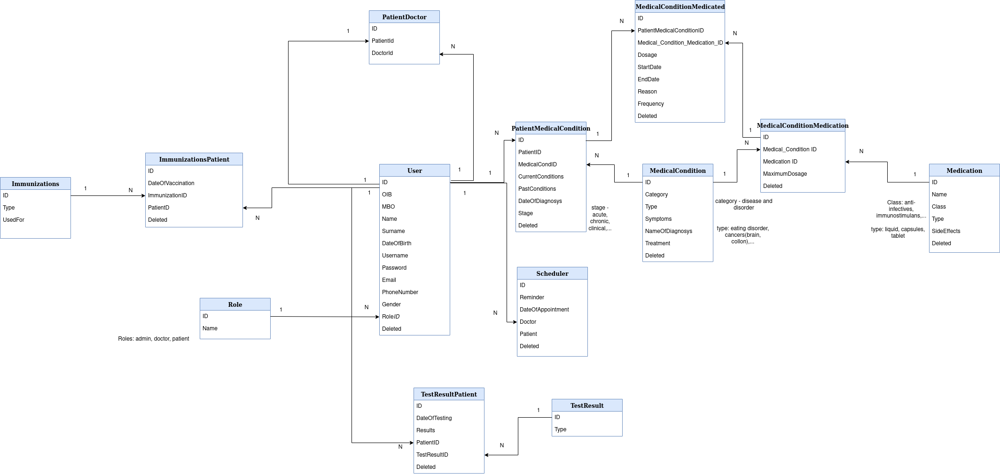

# Hygieia

## About
Web app used for medical personal anamnesis of patient.
## Features
- User Management
  * users can login, sign up as doctor/patient. 
  * doctors can be able to add new patients, remove old patients, edit their patients medical status.
  * patients can be able to change their doctors and view their medical data
  
- Medical History Review
  * information about the patient's past health conditions, including chronic conditions, illnesses and injuries.
  * list of current health conditions
  * saved doctors visits
  
- Test Results
  * information about any test results the patient has received, including blood tests, imaging studies, and other diagnostic tests.
  * provided in .pdf format
  
- Medications
  * information about the medications the patient is currently taking, including the name of the medication, dosage, and frequency.
  
- Follow-up Care
  * information about the patient's follow-up care, including scheduled appointments with healthcare providers, recommended treatments
  
- Reminders
  * doctors can set up a reminder for some date not to forget about the appointment
  * edit and add events
  * includes date of last and next appointment
  
## Tools and frameworks
- Blazor
- ASP.NET
- React
- Bootstrap
- Swagger

## Database Model

